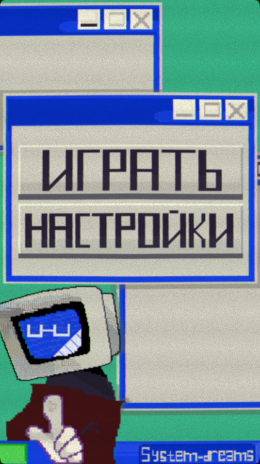
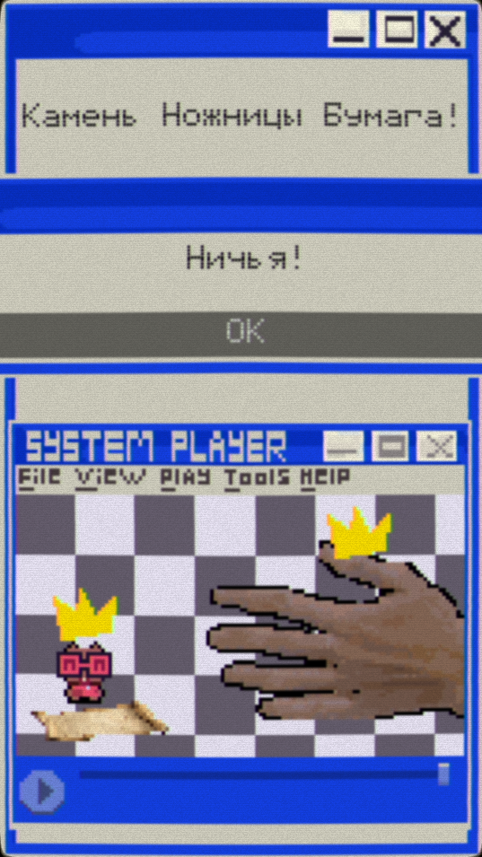
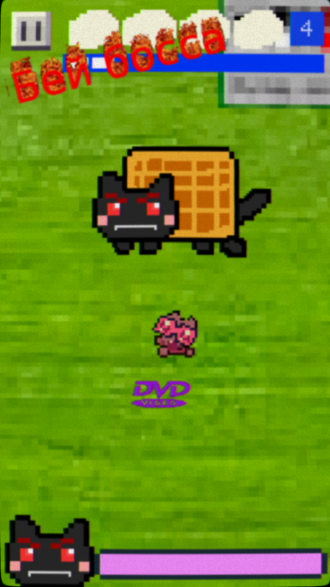

# System-dreams

**рогалик, bullet hell, казуальная, 2D**  
**отражение бесконечных волн врагов, с соответствующей бесконечной прокачкой персонажа**  
**эстетика культуры раннего интернета (2000-2010 годов), глитч-арт**

# Скриншоты
| Меню               | Мини игра             | Смерть          |
| ---------------------- | ---------------------- | ---------------------- |
|  |  |  |

## Технологический стек
- **Движок:** [Godot]
- **Язык программирования:** [GDScript]

## Скачать
Готовые сборки для вашей платформы лежат в папке [`download`](download/):

- **Android** — скачайте `SystemDreamsAndroid.apk`, откройте файл на устройстве и разрешите установку из неизвестных источников.
- **ОС Аврора** — доступны две сборки в зависимости от архитектуры процессора:
  - `org.zeroideas.systemdreamscool-0.0.5-1.armv7hl.rpm` — для устройств с **32-битным ARM** (armv7hl). Подходит для старых планшетов и смартфонов на базе «Авроры».
  - `org.zeroideas.systemdreamscool-0.0.5-1.aarch64.rpm` — для устройств с **64-битным ARM** (aarch64). Рекомендуется для современных устройств на «Авроре».

Для запуска на других ОС (Windows, Linux) инструкция появится позже.

